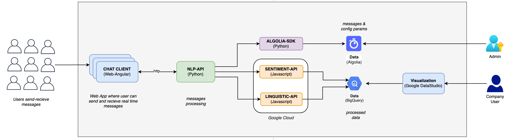
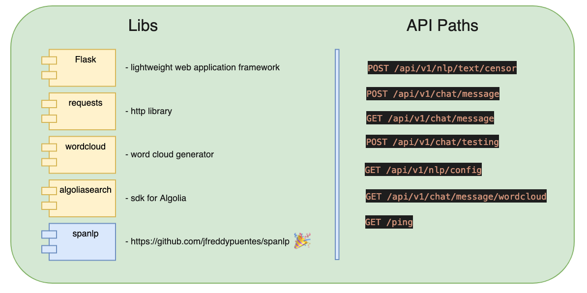
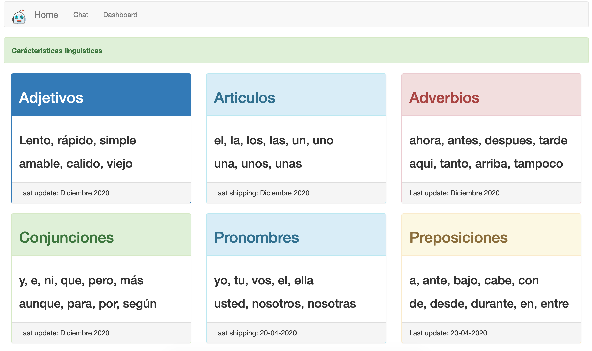
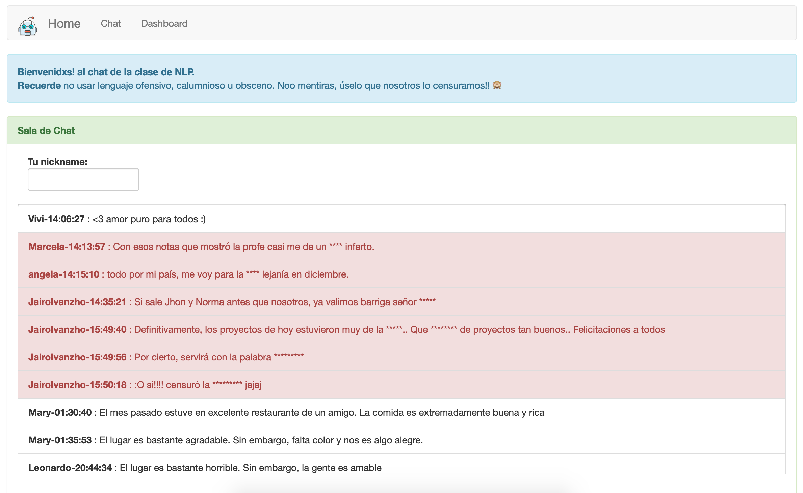

# Proyecto Final NLP
Proyecto final de la clase de NLP.

## ¿De qué se trata?
El proyecto final de la clase de NLP se trata de un [chat](https://nlpchat.web.app/) que censura vulgaridades. La censura se realiza mediante la librería [spanlp](https://github.com/jfreddypuentes/spanlp) (tambien construida en clase). Internamente, los mensajes pasan por un proceso de análisis de sentimientos y de extracción de caracteristicas linguisticas que se pueden visualizar en [este dashboard](https://datastudio.google.com/reporting/b71e7558-2022-4057-99a7-5a02348db65b/page/dvqqB).

## Componentes
1. [Chat](https://nlpchat.web.app/) - Aplicación web construida en Angular y desplegada en Firebase Hosting.
2. [Dashboard](https://datastudio.google.com/reporting/b71e7558-2022-4057-99a7-5a02348db65b/page/dvqqB)
3. [Spanlp](https://github.com/jfreddypuentes/spanlp) - librería Python para detectar, censurar y limpiar groserías, vulgaridades, palabras de odio, racismo, xenofobia y bullying en textos escritos en Español.
4. API. Conjunto de servicios web que soportan el envio, la recepción, procesamiento y almacenamiento de los mensajes, sentimientos y caracteristicas linguisticas.

## Diagrama de Arquitectura

## Componentes de API

## Chat
### Home

### Chat

